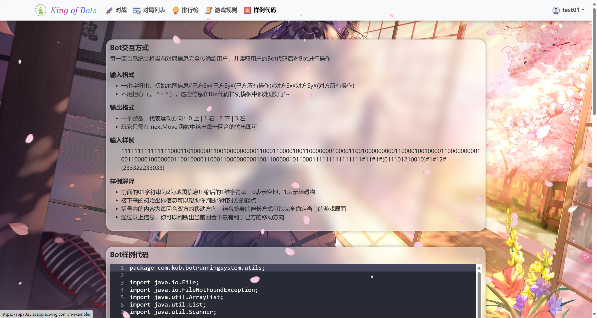

# King of Bots (KOB) - 双人策略对战平台


## 📜 项目简介
一个基于Spring Boot + Vue.js构建的双人代码策略对战平台。玩家可以通过编写AI逻辑代码进行自动化对战，系统采用微服务架构实现高效匹配和战斗执行。

## 🎮 核心功能
- **编码系统**
- **匹配系统**
- **观战系统**

## 🛠 技术架构
### 后端服务 (Spring Boot微服务)
| 服务名称          | 端口  | 职责描述                     |
|-------------------|-------|----------------------------|
| backend           | 3000 | 核心业务逻辑与数据库交互       |
| matchingsystem    | 3001 | 玩家匹配与对战队列管理         |
| botrunningsystem  | 3002 | 代码沙箱与对战执行引擎         |

### 前端框架 (Vue.js)
- **路由管理**：Vue Router
- **状态管理**：Vuex

## 📂 项目结构
```bash
├── backendcloud/          # 后端微服务集群
│   ├── backend/           # 核心服务（用户/对战/排行榜）
│   ├── matchingsystem/    # 匹配系统服务
│   └── botrunningsystem/  # 代码运行沙箱服务
├── web/                   # 前端工程
│   ├── src/views/         # 页面组件
│   │   ├── pk/            # 对战大厅
│   │   ├── record/        # 对战回放  
│   │   └── user/          # 用户中心
│   └── src/assets/scripts # 游戏核心逻辑
└── static/img/            # 项目截图与素材资源
```


## 🖼 界面预览

<div align="center">
  
  
</div>

<div align="center">
  
  
</div>
<div align="center">
  
  
</div>
<div align="center">
  
  
</div>
